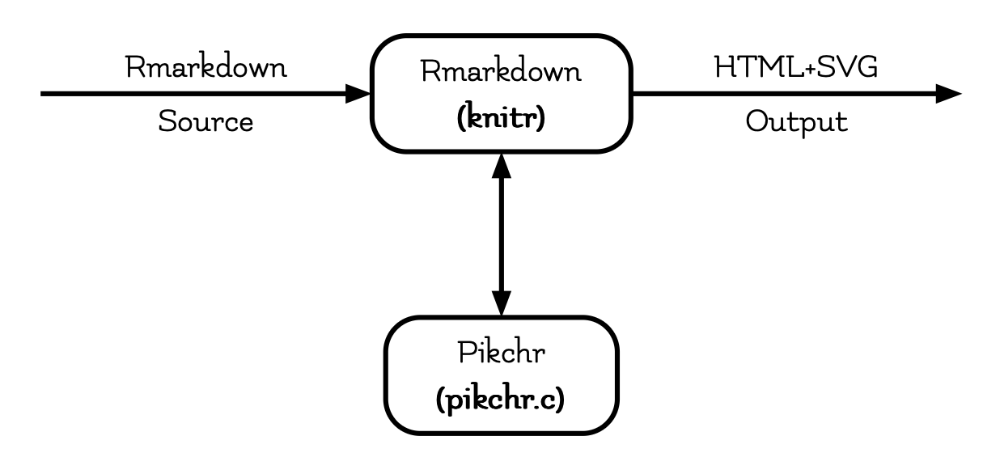
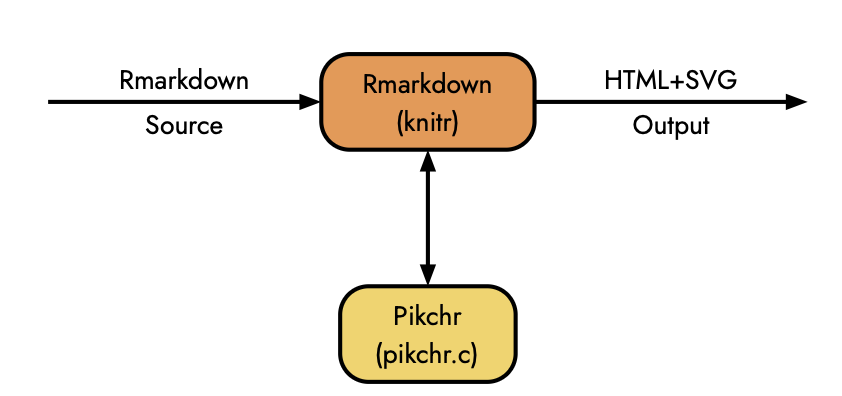
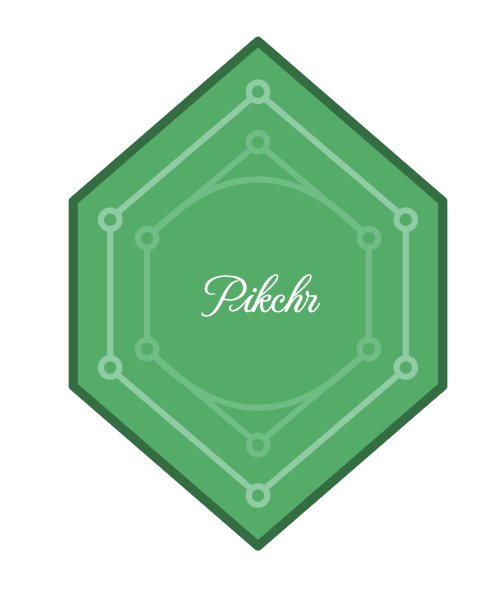

<!-- README.md is generated from README.Rmd. Please edit that file -->

# pikchr <a href="https://github.com/StrategicProjects/pikchr"></a>

<!-- badges: start -->

  

  
<!-- badges: end -->

Welcome to the `pikchr` package website, an R interface for the **PIC
diagramming language**, powered by the parser from <https://pikchr.org>.
The `pikchr` package allows you to create diagrams directly within R,
combining simplicity and precision for efficient diagram generation.

With `pikchr`, you can produce complex diagrams for documentation,
presentations, articles, and more, all from your R environment. The
straightforward nature of the **PIC language**, paired with the power of
R, makes this package a valuable tool for those needing precise,
customizable visualizations in academic, technical, and scientific
projects. Discover how `pikchr` can enhance and streamline your
diagramming workflow!

\## Installation

You can install directly from CRAN or the development version of pikchr
from [GitHub](https://github.com/) with:

``` r
# install.packages("pak")
pak::pak("StrategicProjects/pikchr")
```

``` r
library(pikchr)

pikchr('
/*
basic example code
*/
arrow right 200% "Rmarkdown" "Source" # teste
box rad 10px "Rmarkdown" "(knitr)" bold  fit
arrow right 200% "HTML+SVG" "Output" 
arrow <-> down from last box.s
box same "Pikchr" "(pikchr.c)" bold fit
',
       width = "75%", 
       height = "auto",
       fontSize = '75%',
       fontFamily = "Flamenco")
```



You can also use the `{pikchr}` engine in a `Rmarkdown` document.

```` default
```{pikchr}
#| width: 50%
#| height: auto
#| align: center
#| fontSize: 14
#| fontFamily: Jost
/*
  basic example code in a markdown chunk.
*/
  arrow right 200% "Rmarkdown" "Source" # teste
box rad 10px "Rmarkdown" "(knitr)"  fit fill 0xEE964B
arrow right 200% "HTML+SVG" "Output" 
arrow <-> down from last box.s
box same "Pikchr" "(pikchr.c)" fit fill 0xF4D35E
```
````

<div class="container_pikchr inline-svg unnamed-chunk-5"
style="text-align:center;">



</div>

``` r
lgt = .2

define hex_up { 
    A:line right $1*(sqrt(3)/2) down $1/2 \
        then down $1 \
        then down $1/2 left $1*(sqrt(3)/2) \
        then up $1/2 left $1*(sqrt(3)/2) \
        then up $1 \
        then right $1*(sqrt(3)/2) up $1/2 \
        close color $3 fill $4
    text $2 at last .c color $5
}

define hex_dgr {
   P:(0,0)
   C1: circle rad .01 with .c at P.c thin color $2
   C2: circle rad .01 with .c at C1.c + ($1*(sqrt(3)/2), -$1/2) thin color $2
   C3: circle rad .01 with .c at C2.c + (0, -$1) thin  color $2
   C4: circle rad .01 with .c at C3.c + (-$1*(sqrt(3)/2), -$1/2) thin color $2
   C5: circle rad .01 with .c at C4.c + (-$1*(sqrt(3)/2), $1/2) thin color $2
   C6: circle rad .01 with .c at C5.c + (0, $1) thin color $2
   L1: line from C1.se to C2.nw thin color $2
   L2: line from C2.s to C3.n thin color $2
   L3: line from C3.sw to C4.ne thin color $2
   L4: line from C4.nw to C5.se thin color $2
   L5: line from C5.n to C6.s thin color $2
   L6: line from C6.ne to C1.sw thin color $2
   
}


H2: [hex_up(lgt ,  "Pikchr" small, 0x196F3D, 0x27AE60, white)]
H3: [hex_dgr(lgt*.8, 0x7DCEA0)] with .c at H2.c
H4: [hex_dgr(lgt*.6, 0x52BE80)] with .c at H2.c
```

<div class="container_pikchr inline-svg unnamed-chunk-6"
style="text-align:center;">



</div>
